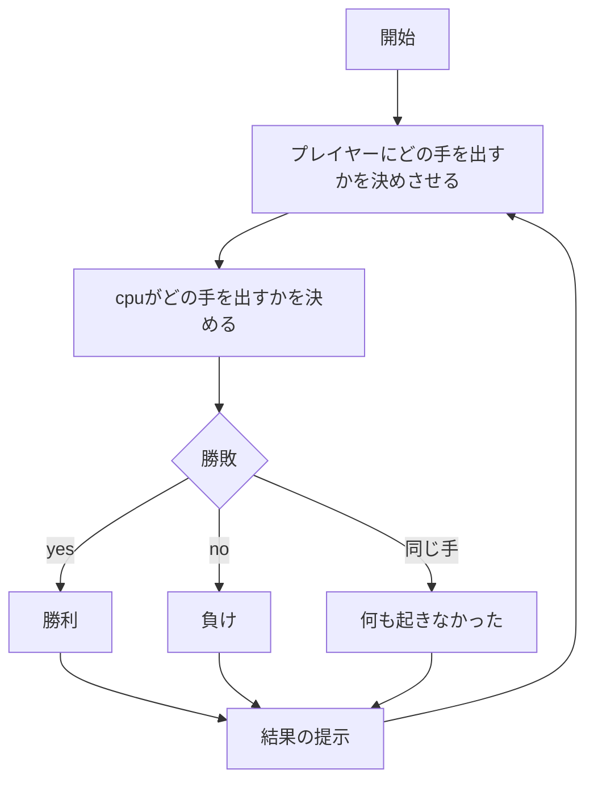
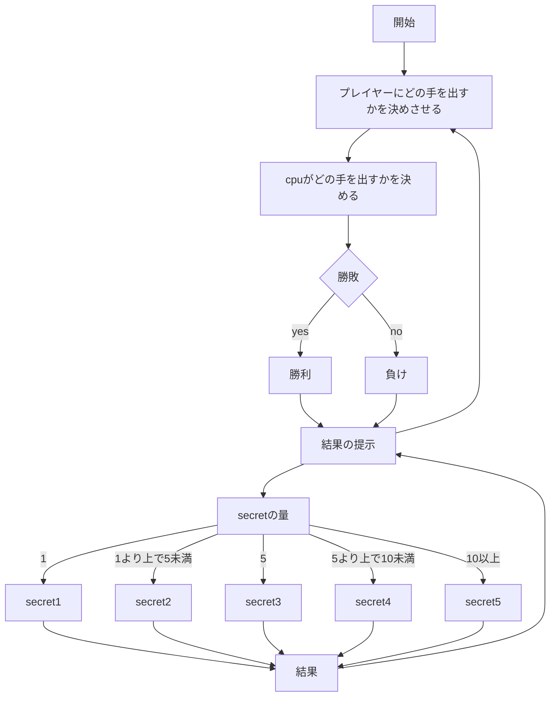
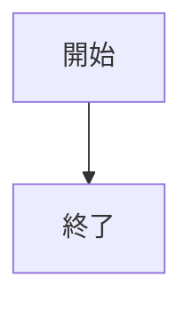
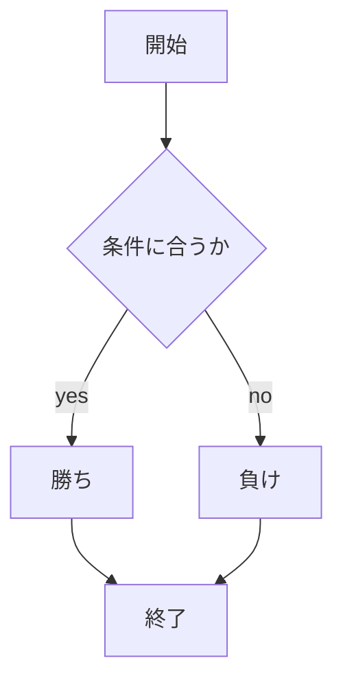

# webpro_06
2024/10/29
## このプログラムについて
## ファイル一覧

ファイル名|説明
-|-
app5.js | プログラム本体
public/first.html | じゃんけんゲームや充電ゲーム，数字あてゲームのURLを書いた画面
public/janken.html |じゃんけんの開始画面
views/janken.ejs | じゃんけんのテンプレートファイル
public/juuden.html |充電ゲームの開始画面
views/juuden.ejs | 充電ゲームのテンプレートファイル
public/magic.html |数字あてゲームの開始画面
views/magic.ejs |数字あてゲームのテンプレートファイル

```javascript
console.log('Hello' );
```

じゃんけんゲームの始め方
1. ダウンロードしたwebpro_06ファイルに```cd```コマンドで入る
1. ```npm install``` でプログラムを動かす準備をする．
1. ```node app5.js ```でプログラムを起動する．
1. webブラウザでlocalhost:8080/public/janken.html にアクセスする．
1. 自分の手を入力する．

充電ゲームの始め方
1. ダウンロードしたwebpro_06ファイルに```cd```コマンドで入る．
1. ```npm install``` でプログラムを動かす準備をする．
1. ```node app5.js ```でプログラムを起動する．
1. webブラウザでlocalhost:8080/public/juuden.html にアクセスする．
1. 充電、バリア、ハーから自分の手を入力する．

数字あてゲームの始め方
1. ダウンロードしたwebpro_06ファイルに```cd```コマンドで入る
1. ```npm install``` でプログラムを動かす準備をする．
1. ```node app5.js ```でプログラムを起動する．
1. webブラウザでlocalhost:8080/public/magic.html にアクセスする．
1. 1~10を提示するcpuの数字を予想する．
1. 予想した数字を半角で入力する．

じゃんけんゲームのルール
1. 「グー」「チョキ」「パー」から自分の手を選ぶ
1. グーはチョキに勝ち，チョキはパーに勝ち，パーはグーに勝つ．

充電ゲームのルール
1. 「充電」「ハー」「バリア」から自分の手を選ぶ
1. ただし，ハーを出すためには充電をしてエネルギーを貯めないといけない
1. 充電のときにハーを打たれると負けてしまう．
1. バリアはハーを出されても問題ない．
1. うまく守り，攻めることで相手を打ち倒そう

数字あてゲームのルール
1. cpuの数字を予想して半角の正の数字を選ぶ
2. それだけ
1. 11以上をいれると....

充電ゲームのフローチャート

数字あてゲームのフローチャート



